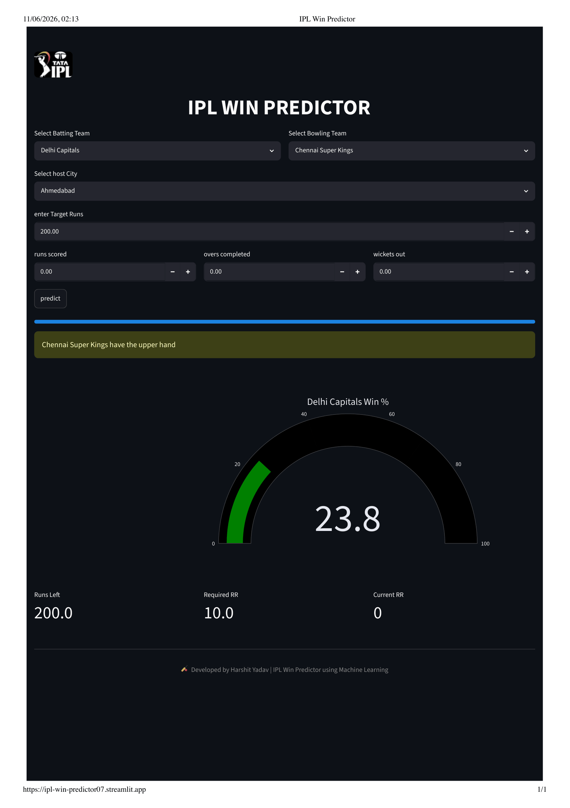

# 🏏 IPL Win Predictor

[](https://ipl-win-predictor07.streamlit.app/)




🔗 Live Demo: https://ipl-win-predictor07.streamlit.app/


A Machine Learning-powered web application that predicts the winning probability of an IPL team during the second innings of a match based on the current match situation.

Built using **Python**, **Scikit-Learn**, and **Streamlit**, this project provides real-time win probability predictions along with match statistics such as Required Run Rate, Current Run Rate, and Runs Left.

## 🚀 Try It Now

Click below to access the deployed application:

👉 https://ipl-win-predictor07.streamlit.app/

---

## 🚀 Features

* Predicts winning probability during live IPL chases
* Interactive Streamlit web interface
* Real-time calculation of:

  * Runs Left
  * Balls Left
  * Wickets Left
  * Current Run Rate (CRR)
  * Required Run Rate (RRR)
* Probability Gauge Visualization using Plotly
* Team and venue selection
* Clean and responsive UI

---

## 📊 Machine Learning Pipeline

### Input Features

The model uses the following features:

* Batting Team
* Bowling Team
* Host City
* Runs Left
* Balls Left
* Wickets Left
* Target Score
* Current Run Rate
* Required Run Rate

### Model Workflow

1. Data Collection and Cleaning
2. Feature Engineering
3. Train-Test Split
4. Data Preprocessing using Pipeline
5. Model Training
6. Probability Prediction using `predict_proba()`
7. Deployment using Streamlit

---

## 🛠️ Tech Stack

### Programming Language

* Python

### Libraries

* Pandas
* NumPy
* Scikit-Learn
* Plotly
* Streamlit
* Matplotlib

### Machine Learning

* Classification Model
* Scikit-Learn Pipeline

---

## 📂 Project Structure

```text
IPL-Win-Predictor/
│
├── app.py
├── pipe.pkl
├── IPL.webp
├── requirements.txt
├── README.md
│
├── notebooks/
│   └── IPL_Win_Predictor.ipynb
│
└── datasets/
    └── matches.csv
```

---

## ⚙️ Installation

### Clone the Repository

```bash
git clone https://github.com/your-username/IPL-Win-Predictor.git
cd IPL-Win-Predictor
```

### Create Virtual Environment

```bash
python -m venv myenv
source myenv/bin/activate
```

### Install Dependencies

```bash
pip install -r requirements.txt
```

### Run the Application

```bash
streamlit run app.py
```

---

## 📈 Sample Prediction

### Input

* Batting Team: Chennai Super Kings
* Bowling Team: Mumbai Indians
* Target: 180
* Score: 120/4
* Overs: 15

### Output

* Win Probability: 65%
* Loss Probability: 35%
* Required RR: 12.00
* Current RR: 8.00

---

## 🎯 Future Improvements

* Live IPL score integration
* Team logos and branding
* Historical match insights
* Match situation analysis
* Advanced ensemble models

---

## 👨‍💻 Author

**Harshit Yadav**

Aspiring AI/ML Engineer passionate about Machine Learning, Data Science, and Full-Stack AI Applications.

🔗 Live App: https://ipl-win-predictor07.streamlit.app/

🔗 GitHub: https://github.com/harshity07

🔗 LinkedIn: https://www.linkedin.com/in/harshity7/

---

## ⭐ Support

If you found this project useful, consider giving it a ⭐ on GitHub.
